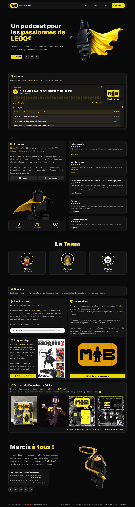
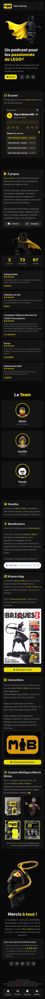

# Men in Bricks Landing Page

## Description

This repository contains the official landing page for Men in Bricks, a French podcast for LEGO® enthusiasts.  
It is a lightweight, static website designed to be fast, responsive, and visually engaging.

## Objectives

- Provide a clean and modern landing page for the podcast.
- Offer quick access to listening platforms and subscription links.
- Showcase the project’s community.
- Experiment with front-end animation and a lightweight 3D viewer.
- Add "bonus" content.

## Tech Stack


## File Description

| **FILE**     | **DESCRIPTION**                                     |
| :----------: | --------------------------------------------------- |
| `assets`     | Contains the resources required for the repository. |
| `index.html` | Contains the resources required for the repository. |
| `style.css`  | Styles and animations for the project.              |
| `script.js`  | Behavior script for interactivity.                  |
| `viewer.jd`  | Three.js viewer initialization and controls.        |
| `CNAME`      | Defines the custom domain name for the website.     |
| `README.md`  | The README file you are currently reading 😉.       |

## Installation & Usage

### Installation

1. Clone this repository:
    - Open your preferred Terminal.
    - Navigate to the directory where you want to clone the repository.
    - Run the following command:

```
git clone https://github.com/fchavonet/full_stack-men_in_bricks_landing_page.git
```

2. Open the cloned repository.

### Usage

1. Open the index.html file in your web browser.

You can also test the project online by clicking [here](https://fchavonet.github.io/full_stack-men_in_bricks_landing_page/).

<table align="center">
    <tr>
        <th align="center" style="text-align: center;">Desktop view</th>
        <th align="center" style="text-align: center;">Mobile view</th>
    </tr>
    <tr valign="top">
        <td align="center">
            <picture>
                
            </picture>
        </td>
        <td align="center">
            <picture>
                
            </picture>
        </td>
    </tr>
</table>

## What's Next?

- Improve Lighthouse scores (performance/accessibility).
- Improve the 3D viewer UX (loading indicator, touch controls tuning)

## Thanks

- Thanks to Alexis and Aurélie for their invaluable help and unfailing friendship.
- Thanks to everyone supporting Men in Bricks !!!

## Author(s)

**Fabien CHAVONET**
- GitHub: [@fchavonet](https://github.com/fchavonet)
